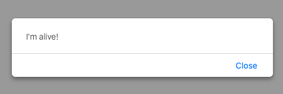
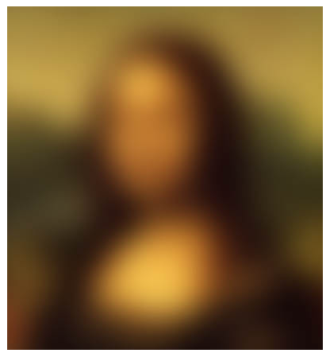
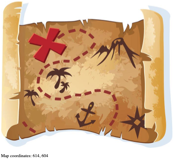
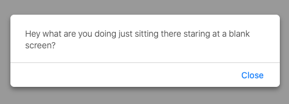

# hfjsChap9

From the book Headfirst Javascript.

handler.html -> reveals handler

imageGuess.html -> Click a blurred image to reveal true image

mapCoOrds.html -> Reveal map co-ordinates using onmousemove property

timerHandler.html -> trigger an alert after 5 seconds using a timer

